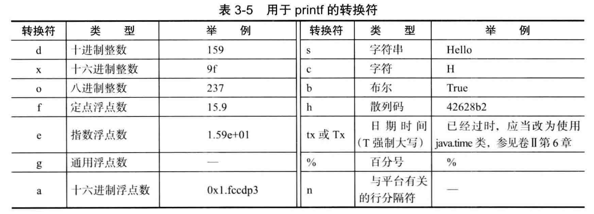
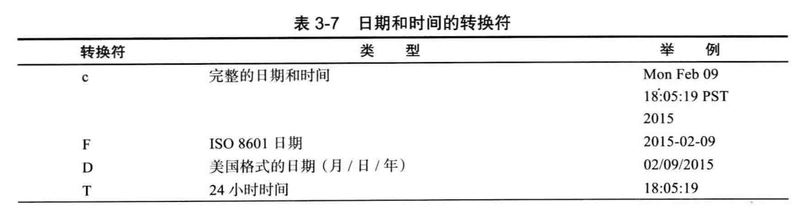
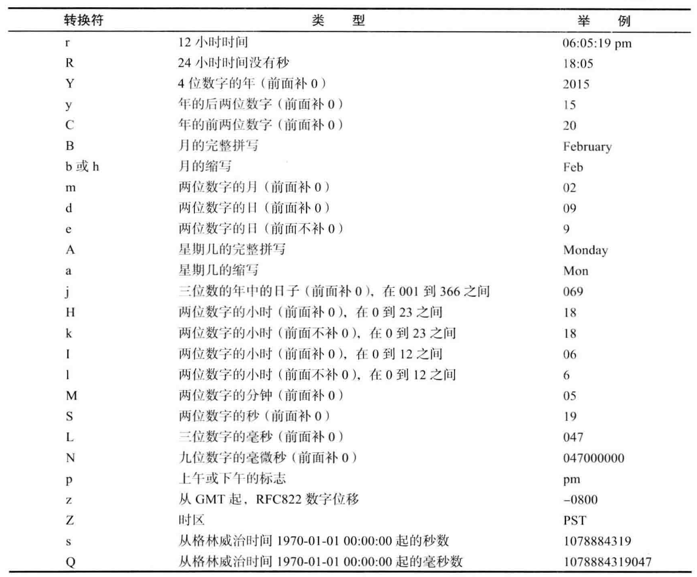
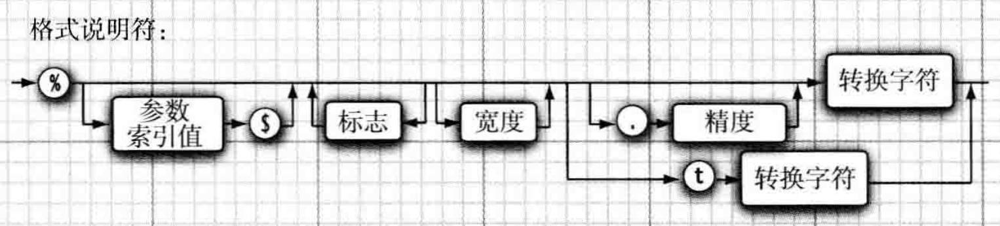
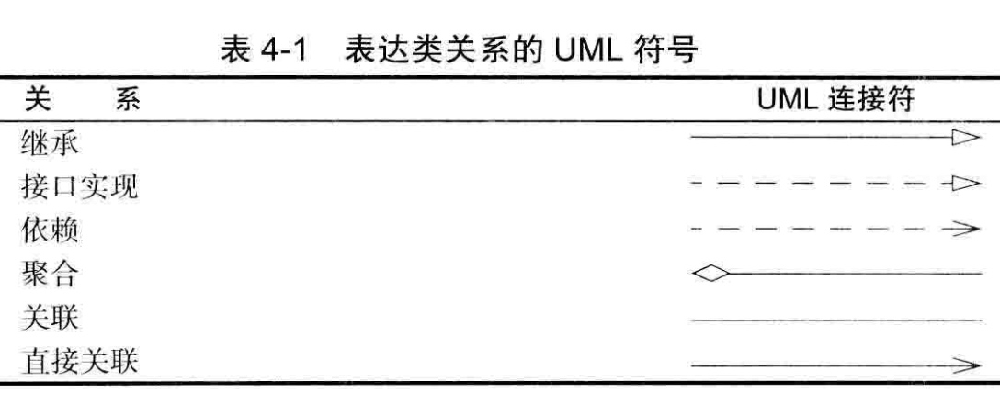

## Java核心技术.卷1基础知识

### 第2章：Java基本程序设计结构

- Java语言规范，main方法必须声明为public

Java虚拟机从指定类的main方法开始执行。
```
public class ClassName {
	public static void main(String[] args) {
		System.out.print("hello");
	}
}
```

3.3 数据类型

Java是一种强类型语言，共有8种基本类型。

- 4种整型
	- int：4字节（-20亿 ~ 20亿）
	- short：2字节（-32768 ~ 32768）
	- long：8字节
	- byte：1字节（-128 ~ 127）
- 2种浮点类型
	- float：4字节（有效位数为6~7位）。float类型的数值有一个F或f的后缀。如果没有F或f后缀的，默认为double类型。也可以在浮点数值后添加D或者d
	- double：8字节（有效位数为15位）
- 1种用于表示Unicode编码的字符单元的字符类型char
- 1种表示真值的boolean类型

码点（code point）是指与一个编码表中的某个子符对应的代码值。在Unicode标准中，码点采用十六进制书写，并加上前缀U+

UTF-16编码采用不同长度的编码表示所有Unicode码点。

强烈建议不要在程序中使用char类型。

在Java中，变量的声明尽可能的靠近第一次使用的地方，这是一种良好的编码习惯。

final指示常量。只能被赋值一次，一旦被赋值之后，就不能再更改了。习惯上常量名全使用大写。


枚举类型：
```
enum Size { 
	SMALL, 
	MEDIUM, 
	LARGE, 
	EXTR_LARCE 
};
```

Java字符串就是Unicode字符序列。Java没有内置的字符串类型，而是在标准类库中提供了一个预定义类。

使用string.equals(t)  来比较两个字符串是否相等，千万不要使用 = 号

if(str != null && str.length() != 0)

格式符的转化：


格式化时间：

```
System.out.printf("%tF",new Date());
# 自定义日期格式，通过字符串格式化的方式，用%开头，然后加上索引号，以$结尾。如下
System.out.printf("%1$s %2$tB %2$te %2$tY","Date:",new Date());
# 也可以使用以下语句。用 < 号来表示前面参数格式将被再次使用
System.out.printf("%s %tB %<te, %<tY", "Due date:", new Date());
```



printf的格式说明：



读取文件里，一般要指定文件的编码，如果没有指定，默认读取的是运行java机器的默认编码，这可能会导致同一段程序在不同默认机器编码的服务器上得到不一样的结果

先判断条件，可能不执行

```
while (condition) {
}
```

至少执行一次

```
do {
}
while (condition)
```

可以通过break+标签符号的方式来跳出多种嵌套循环。

```
int i = 20;
int count = 20;
read://定义一个标签符号
while (i > 1) {
	for (int j = 0;j<count;j++){

		if (j == 10) {
			break read;//跳出到标签符
		}
	}
	System.out.println(Integer.toString(i));
	i--;
}

```

也可以通过定义lab来控制跳出语句。

```
lab:
{
    if (i<20) break lab;
}
```



static 静态域定义。常用来定义变量或常量，比如一个类中定义了一个静态变量，所有的类对象都是共享这个静态变量。如下：

```
Class Employee {
	private static int nextId = 1;
	private int id;
}
```
如果new Employee() 1000个对象，会有1000个类的id，但是他们会共享一个nextId

static final 静态变量。

也可以将方法或类声明为final类型，主要目的是确保它们不会在子类中改变语义。

静态方法是一种不能向对象实施操作的方法。有两种情况下使用静态方法：

- 一个方法不需要访问对象状态，其所需参数都是显示参数提供
- 一个方法只需要访问类的静态域

每个类都可以有一个main方法，这是一个常用于对类进行单元测试的技巧。

```
public static void main(String[] args) {

}
```

- 一个方法不能修改一个基本数据类型的参数（即数值型或布尔型）
- 一个方法可以改变一个对象参数的状态
- 一个方法不能让对象参数引用一个新的对象

#### 包
使用包的主要原因是确保类名的唯一性。为了保证包名的绝对唯一性，Sun公司建议将公司的因特网域名以逆序形式作为包名。比如com.alibaba

从编译器的角度看，嵌套的包之间没有任何关系。比如java.util和java.util.jar包毫无关系

如果出现导入的两个包都包含相同的类，比如java.util和java.sql中都包含了 Date类，会提示包冲突。
这是可以通过增加一个特定的import语句来解决。

```
import java.util.*;
import java.sql.*;
import java.util.Date; # 增加一个显示的导入

import static java.lang.System.*; # 可以增加一个静态包的导入
```

如果想将一个类放入包中，就必须将包的名字放在源文件的开头。如下
package com.google.hello

如果没有定义package，那么会将该类放入一个默认包

将包中的文件放到与完整的包名匹配的子目录中。如果包与目录不匹配，虚拟机就找不到类。

虚拟机要搜寻 com.google.core.Employee类文件，它首先要查看存储在jre/lib和jre/lib/ext目录下的归档文件中所存放的系统类文件。显然，在那里找不到相应的类文件，然后再查看类路径。建议利用-classpath选项设置类路径。

注释以  /** 开头，以*/结束

几个类设计的技巧：

- 一定要保证数据私有
- 一定要对数据初始化：最好不要依赖系统的默认值，而是应该显示的初始化所有的数据。
- 不要在类中使用过多的基本类型
	- 如果有很多基本类型，可以封装成一个独立的类进行引用	
- 不是所有的域都需要独立的域访问器和域更改器
- 将职责过多的类进行分解
- 类名和方法名要能够体现他们的职责
- 优先使用不可变的类

```
if (staff[1] instanceof Manager) { #用instanceof先判断一下类型能否转换成功。
	boss = (Manager) staff[1];
}
```

- 只能在继承层次内进行类型转换
- 在将超类转换成子类之前，应该使用instanceof进行检查。
- 一般情况下，应该尽量少用类型转换和instanceof运算符
- 为提高程序的清晰度，包含一个或多个抽象方法的类本身必须被声明为抽象的。
- **抽象方法充当着占位的角色，它们的具体实现在子类中。扩展抽象类可以有两种选择**。
- **类即使不含抽象方法，也可以将类声明成抽象类。抽象类不能被实例化**。
- 子类也不能访问超类中的私有对象
- protected 对本包和所有子类可见。

```
public abstract class Person {
	private String name;
	public Person(String name) {
		this.name = name;
	}
	
	public String getName() {
		return name;
	}
	
	public abstract String getDescription();
}

public class Employee extends Person {
	public Employee(String name,String major) {
		super(name);
		this.major = major;
	}
	
	public String getDescription() {
		return "eeeee";
	}
}

#定义了Person抽象类。Employee继承Person
# 因为Person是抽象类，无法实例化，所以需要用子类实例化

Person p = new Employee("long");
System.out.print(p.getDescription());
```


- Object:所有类的超类
- Object类中的equals方法用于检测一个对象是否等于另外一个对象。判断两个对象是否具有相同的引用，如果两个对象具有相同的引用，它们一定是相等的。
- Objects.equals(a,null) 可以这样来判断a是否为null。当然一般情况下直接使用 == 来判断是否null更为直接简单
- 字符串的散列码是由内容导出的。所以相同的String定义的变量的hashCode值是一样的。但是StringBuffer类中没有定义hashCode，它的散列码是由Object类的默认hashCode方法导出的对象存储地址。
- hashCode与equals结果必须一致，如果相同的两个对象，它们的hashCode是一致的。

#### toString()
- 只要对象与一个字符串通过操作符"+"连接起来，Java编译器就会自动的调用toString方法，以便获得这个对象的字符串描述。

```
Person p = new Persion();
System.out.print("name="+p);  #这里的会直接调用p.toString()
```

- 打印数组，使用 Arrays.toString(数组)
- ArrayList是一个采用类型参数的泛型类。
	- ArrayList<Person> person = new ArrayList<>();
- trimToSize() 将数组列表的存储容量消减到当前尺寸
- Integer类对应的基本对象是int，将Integer类型的对象赋给int值时，将会自动的拆箱。

#### 变量
**transient**

java语言的关键字，变量修饰符，如果用transient声明一个实例变量，当对象存储时，它的值不需要维持。换句话来说就是，用transient关键字标记的成员变量不参与序列化过程。


