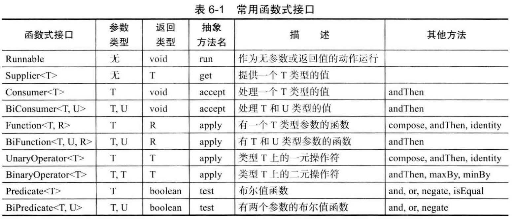

## 第六章：接口、lambda表达式与内部类
- 接口不是类，而是对类的一组需求描述，这些类要遵从接口描述的统一格式进行定义。
- 接口中所有的方法都自动的属于public。因此，在接口中声明方法时，不必提供关键字public。但是在实现类中必须将方法声明为public
- implements 实现接口的关键字  class Person implements Comparable
- 可以使用instanceof来检查一个对象是否实现了某个特定的接口

```
if (anyObject instanceof Comparable ) {...}
```

- 接口也可以扩展另外的接口，这个超类的使用方式一样。
- 接口中也可以定义变量，接口中的域都自动被设为 public static final类型.虽然可以显示定义，但是并不推荐，因为没必要有那么多冗余的关键字。
- 每个类只能够拥有一个超类，但却可以实现多个接口。这就为定义类的行为提供了极大的灵活性。比如要设计一个类具备克隆和比较的能力，实现两个接口即可。

```
class Employee implements Cloneable,Comparable {
	...
}
```
- 有些情况下会有定义抽象类，然后在子类中重写抽象类中的方法。这个跟定义接口，然后继承接口实现方法有一定的相似性。但是抽象类有一个问题就是类的继承只能扩展一个类。
- 浅拷贝：如果clone对象中引用了其他的子对象，在clone的时候不会克隆子对象。


### lambda表达式
lambda表达式语法：
参数，箭头->，以及一个表达式，如果代码要完成的计算无法放在一个表达式中，就可以将这些代码放在{}中，如下：

```
(String first,String second) - >
{
	return first.length() - second.length();
}
```

即使lambda表达式没有参数，仍然要提供空括号，就像无参方法一样。如下：

```
() - > { for (int i=100;i>=0;i++) System.out.print(i);}
```

- this::equals 等同于x->this.equals(x)
- 使用lambda表达式的重点是延迟执行
- repeat(10, () -> System.out.println("hello,world"));



#### 代理(略高级技术，需深入)
- 利用代理可以在运行时创建一个实现了一组给定接口的新类，这种功能只有在编译时无法确定需要实现哪个接口时才有必要使用。
- 创建代理对象，需要使用Proxy类的newProxyInstance方法，这个方法有三个参数：
	- 类加载器(class loader)
	- Class对象数组，每个元素都是需要实现的接口
	- 调用处理器
- 使用代理的原因：
	- 路由对远程服务器的方法调用
	- 在程序运行期间，将用户接口事件与动作关联起来
	- 为调试，跟踪方法调用
- 注意：代理类是在运行过程中创建的，一旦被创建，就变成了常规类，与虚拟机中的任何其他类没有什么区别
- 所有的代理类都扩展于Proxy类，一个代理类只有一个实例域-调用处理器，它定义在Proxy的超类中。


