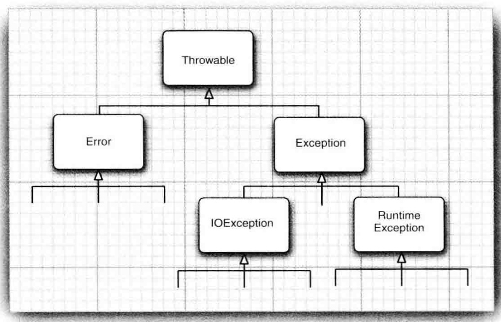
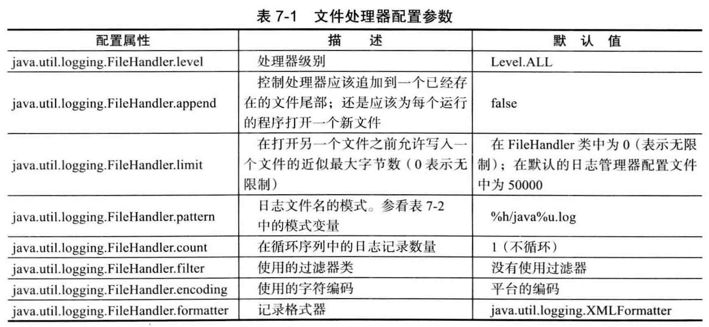
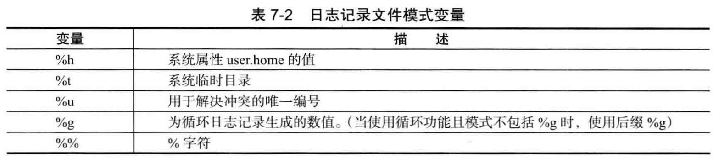

## 第7章：异常、断言和日志
- 异常对象都是派生于Throwable类的一个实例
- 简化的java异常层次结构图


- Throwable下一层分解为两个分支，Error和Exception
	- Error：描述了java运行时系统的内部错误和资源耗尽错误，应用程序不该抛出这类错误。
	- Exception：又分解成两个分支
		- RuntimeException：由程序错误导致的异常
		- IOException：程序本身没有问题，是由于像I/O错误这类问题导致的异常属于其他异常。

- 自定义异常类，可以派生于Exception的类，或者子类的类。自定义的异常类应该包含两个构造器，一个是默认的构造器，另一个是带有详细描述信息的构造器。

```
class FileFormatException extends IOException {
	public FileFormatException() {};
	public FileFormatException (String gripe) {
		super(gripe);
	}
}
```

- 针对异常有两种处理方式。一种是通过try,catch捕获进行处理，一种是通过throw抛出异常。如果是基础性的功能，一些明确的异常情况可以通过哟throw抛出，让调用者处理这些异常信息。

```
InputStream in = ...
try {
	try {
		code..
	} finally {
		in.close();
	}
} catch (IOException e) {
	show error message
}

嵌套一个try有一个好处，就是确保in是关闭状态的，而且如果在finally代码块中出现异常，也能被catch捕获。
```
- 抛异常的准则：早抛出，晚捕获

#### 断言
- 启动和禁用断言是类加载器(class loader)的功能。
- 默认情况下，断言是被禁用的。可以在运行程序时用-enableassertions 或-ea选项进行启用。java -ea MyApp
- 如果禁用的情况下，类加载器会自动跳过断言，因此不会降低程序运行的速度。
- 什么时候选择使用断言：
	- 断言失败是致命的、不可恢复的错误。
	- 断言检查只用于开发、测试阶段

#### 日志
- 7个日志记录器级别(默认情况下，只记录前三个级别)
	- SERVER
	- WARNING
	- INFO
	- CONFIG
	- FINE
	- FINER
	- FINEST
- 默认的日志配置记录了INFO或更高级别的所有记录。默认的日志处理器不会处理低于INFO级别的信息。
- 默认的日志记录将显示包含日志调用的类名和方法名，如同堆栈所显示的那样。
- 记录程序中的异常信息，一般使用以下方法：

```
if (...) {
	IOException exception = new IOException("..");
	logger.throwing("com.mycompay.app","read",exception);
}

或者

try {
	... 
} catch (IOException e) {
	logger.getLogger("com.mycompany.app").log(Level.WARNING, "Reading image",e);
}
下面这种方式非常的普遍
```

- 可以通过编辑配置文件来修改日志系统的各种属性，默认情况下，配置文件存在于 jre/lib/logging.properties。如果想自定义存储配置文件，需要将 java.util.logging.config.file设定为特定路径文件
- 默认情况下，日志记录器将记录发送到ConsoleHandler中，并由它输出到System.err流中。
- 日志API提供了两个有用的日志处理器。
	- FileHandler：收集文件中的记录
	- SocketHandler：将记录发送到指定的主机和端口

	

- Logger logger = Logger.getLogger("com.mycompany.app"); 获取一个日志记录器

#### 调试技巧
- 在每个类中放置一个单独的main方法，是一个非常有效的技巧，这样可以对每个类进行单元测试。（但常见的方式是在test目录下建对应的测试类）

```
public class MyClass {
	code
	
	public static void main(String[] args) {
		test code
	}
}
```
- 要想观察类的加载过程，可以用-verbose标志启动Java虚拟机。这种方法有助于诊断由于类路径引发的问题。
- Java虚拟机增加了对java应用程序进行监控（monitoring）和管理（management）的支持。它允许利用虚拟机中的代理装置跟踪内存消耗、线程使用、类加载等情况。
- JDK加载了一个称为jconsole的图形工具，可以用于显示虚拟机性能的统计结果。
- jmap 获得一个堆的转储，其中显示了堆中的每个对象。使用命令如下： 

```
jmap -dump:format=b,file=dumpFileName processID
jhat dumpFileName
然后通过浏览器访问 localhost:7000 将会运行一个网络应用程序，借此探查转储对象时堆的内容。
```
- 如果使用Xprof标志运行Java虚拟机，就会运行一个基本的剖析器来跟踪那些代码中经常被调用的方法。剖析信息将发送给System.out，输出结果中还会显示哪些方法是由即时编译器编译的。

