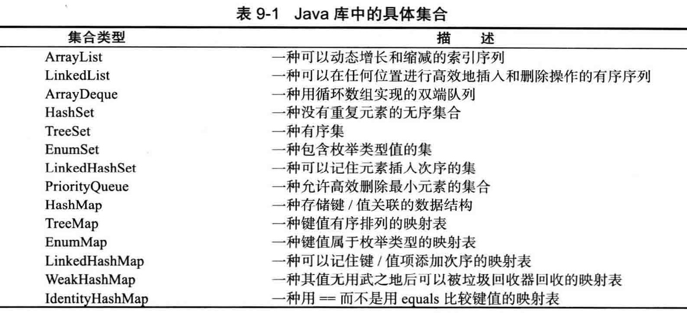
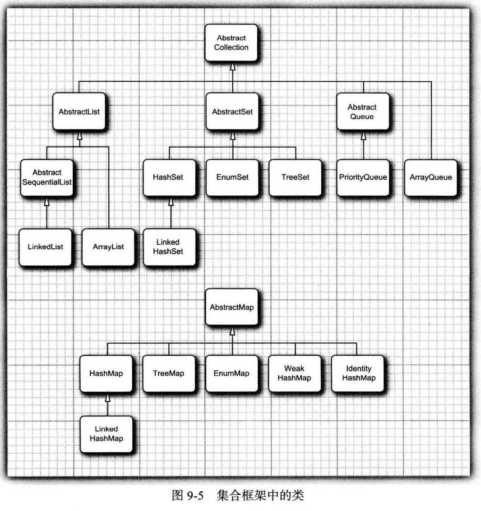

## 集合




Set<Sting> words = new HashSet();

TreeSet 树集是一个有序集合。排序是用数据结构完成得（用的是红黑树）。每次将一个元素添加到树中时，都被放置在正确得排序位置上，因此，迭代器总是以排好序得顺序访问每个元素。比如：

```
SortedSet<String> sorter = new TreeSet<>();
sorter.add("Bob");
sorter.add("Amy");
sorter.add("Cal");

for (String s: sorter) {
	System.out.print(s);
	//输出 Amy,Bob,Cal
}
```

优先级队列：priority queue
元素可以按照任意的顺序插入，却总是按照排序得顺序进行检索。也就是说，无论何时调用remove方法，总会获得当前优先级队列中最小的元素，并不需要对它们进行排序。

- 优先级队列使用了一个优雅且高效得数据结构 -- 堆（heap），堆是一个可以自我调整得二叉树，对树进行添加或者删除操作，可以让最小得元素移动到根，而不必花费时间对元素进行排序。


jar cvf JARFileName file1 File2
jar cvf test.jar *.class icon.gif

