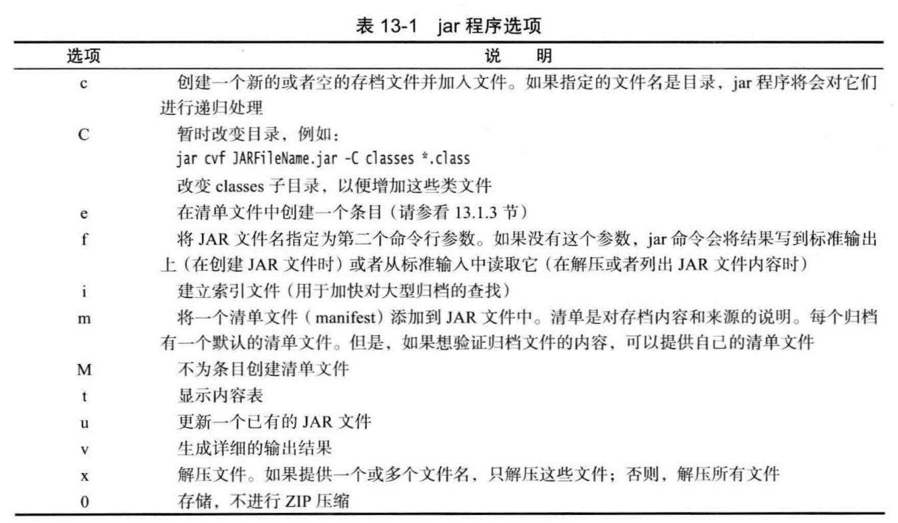

## 部署

jar cvf JARFileName File1 File2

jar cvf test.jar *.class icon.gif

清单文件 MANIFEST.MF ,它位于JAR文件得一个特殊META-INF子目录中。清单是对存档内容和来源得说明，每个归档有一个默认得清单文件。

jar cvfe MyProgram.jar com.mycompany.mypkg.MainAppClass files 
可以使用jar命令中的e选项指定程序的入口点，即通常需要在调用java程序加载器时指定的类。
也可以在清单中指定应用程序得主类。
Main-Class: com.mycompany.mypkg.MainAppClass

警告：清单文件得最后一行必须以换行符结束，否则无法被正确读取。常见得错误是创建了一个只包含Main-Class而没有结束符得文本文件。

启动应用程序： java -jar MyProgram.jar

https://zhuanlan.zhihu.com/p/20781862
