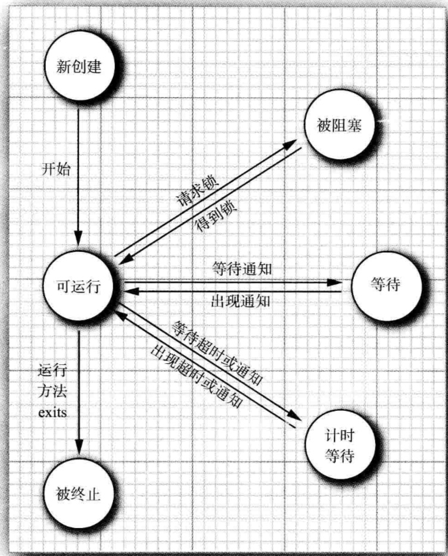
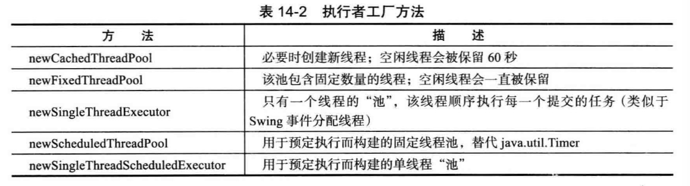

## 并发

多进程和多线程有哪些区别呢？本质得区别是每个进程都拥有自己的一整套变量，而线程则共享数据。共享变量使线程之间得通信比进程之间的通信更有效、更容易。创建一个线程比创建一个进程开销要大的多。

线程有6种状态：

- New
- Runnable 可运行
- Blocked 被阻塞
- Waiting 等待
- Timed waiting 计时等待
- Terminated 被终止

getState：获取一个线程的当前状态。

new Thread(r) : 创建一个新线程。
一个可运行的线程可能正在运行也可能没有运行。

线程状态：


setPriority方法：提高或降低任何一个线程的优先级。
线程的优先级高度依赖系统。

yield():导致当前执行线程处于让步状态。

#### 守护线程
t.setDaemon(true) 将线程转换为守护线程（daemon thread）。守护线程的唯一用途是为其他线程提供服务。

当只剩下守护线程时，虚拟机就退出了，由于如果只剩下守护线程，就没必要继续运行程序了。

守护线程应该永远不去访问固有资源，如文件、数据库，因为它会在任何时候甚至在一个操作的中间发生中断。

线程组是一个可以统一管理的线程集合。默认情况下，创建的所有线程术语相同的线程组


有两种机制防止代码块受并发访问的干扰。

1. synchronized 关键字：自动提供一个锁以及相关的条件

	```
	public synchronized void method() {
		
	}
	```
2. ReentrantLock
	
	```
	myLock.lock();
	try {
		
	} finally {
		myLock.unlock();
	}
	```
	确保任何时候只有任何一个线程进入临界区oo
	
	锁用来保护代码片段，任何时候只能有一个线程执行被保护的代码
	

- volatile 关键字为实例域得同步访问提供了一个免锁机制。
- ThreadLocal辅助类为各个线程提供一个单独的生成器。
- stop和suspend、resume方法已经被弃用。


### 线程池
- 构建一个新的线程是有一定代价的，因为涉及与操作系统的交互。如果程序中创建了大量的生命期很短的线程，应该使用线程池（thread pool）。一个线程池中包含了许多准备运行的空闲线程，将Runnable对象交给线程池，就会有一个线程调用run方法，当run方法退出时，线程不会死亡，而是在池中准备为下一个请求提供服务。
- 另外一个使用线程池的理由是较少并发线程的数目，创建大量线程会大大降低性能甚至使虚拟机奔溃。如果一个会创建许多线程的算法，应该使用一个线程数"固定的"线程池以限制并发线程的总数。

- 执行器（Executor）类有以下静态工厂方法用来构建线程池。


