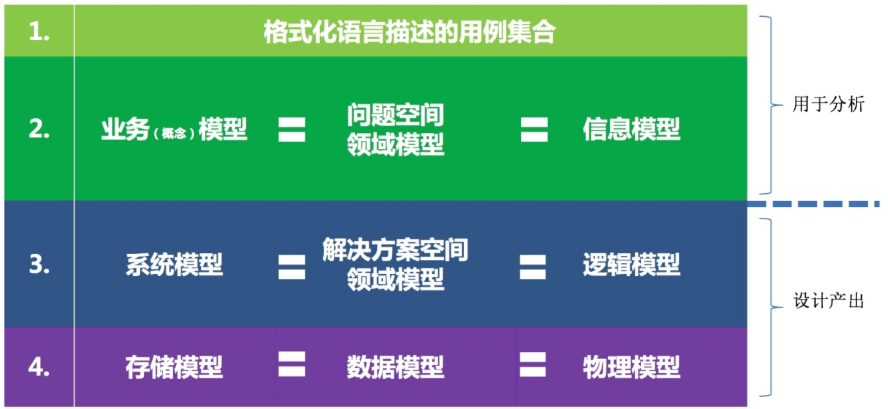
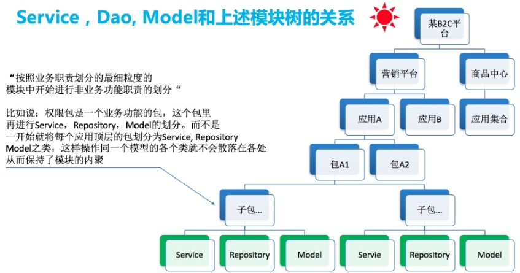
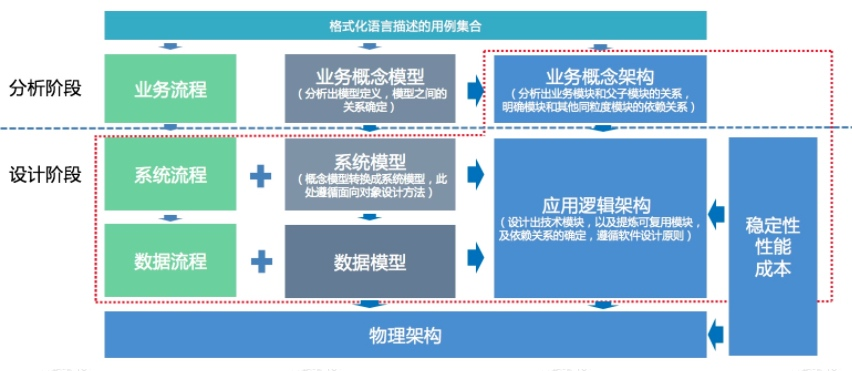

## 从工程师到架构师的成长之路

原文地址：https://zhuanlan.zhihu.com/p/20781862

### 前言
- 架构师是一个没有被严格定义的角色
- 定义：任何复杂结构的设计人员
- 软件架构师是为了『大图』而存在，做好顶层设计，充当需求方和实施者得桥梁。这是架构师的两个重要职责
- 架构的技术职责
	- 架构师要站在整体软件系统的高度上，考虑系统设计的技术合理性，需求实现得完整性，商业诉求的匹配度
- 架构的组织职责
	- 架构师是技术团队面向产品设计的等团队的接口人，负责勾勒蓝图，明确边界，让不同技能得团队通力协作，最终完成软件系统的整体建设和发布

### 架构的技术职责

#### 技术职责分三大块
##### 1. 抽象设计
- 需要能自由地在不同得抽象层次和视角上分析需求，不同得架构层次/视角提供了不同的视图，这些视图相互验证，又能构成整体的设计大图。

抽象层次分两个维度

- 垂直维度
	- 从上到下，分成企业架构、解决方案架构、应用架构、系统架构等，这个分层的逻辑，是提供不同颗粒度的业务建模。
	- CTO关注==企业架构==，它体现了一个企业整体得IT技术逻辑的战略选择，典型得就是集中式和SOA、云计算等。企业架构匹配商业模式。
	- 产品经理和运维关注==应用架构==，这里映射了产品的业务流程和应用的整体部署依赖。
	- 外部客户关注==解决方案架构==，它定义了如何通过产品得整合和协同，解决特定客户的特定的技术方案需求。
	- 研发关注==系统架构==，这里定义了单个系统得领域建模和系统框架
- 水平维度
	- 具体到堆某一个业务的架构设计，又可以区分出业务架构、数据架构、技术架构、应用架构几个不同的视角。
	- ==业务架构==：是对业务领域和业务流程的分析抽象，需要提炼出业务的核心领域模型，业务的可变和不变部分，这是架构师和产品经理协同完成的。业务架构匹配业务模式。
	- ==数据架构==：基于业务架构提炼得核心领域模型做数据模型和存储模型的设计
	- ==技术架构==：基于业务的性能，可用性，安全等非功能指标，确定语言、框架、中间件、部署等技术选型
	- ==应用架构==：基于业务抽象设计应用系统的层次结构、系统边界等

##### 2. 非功能设计
- 架构师的另一个职责是对非功能需求的分析，这也是『架构服务于功能，高于功能』的含义。非功能需求包括了软件系统的可靠性、扩展性、可测性、数据一致性、安全和性能等

##### 3. 关键技术设计
- 架构师的最后一个技术职责是关键技术设计。架构师需要堆可能影响到软件系统整体质量的关键部分，做更细节的详细设计。

### 架构的组织职责
架构师是企业的一员，作为『边界人』，承担着在不同角色、团队之间沟通协调的作用。

- 和业务、产品团队的协作。架构师需要和业务、产品团队紧密合作，确定软件系统的业务架构和领域模型，业务和领域模型抽象的好坏，决定了软件产品是一次性的解决方案，还是可以持续支撑业务成长的真正的产品。
- 和技术团队的协作。负责整体大图得传导，以及应用和团队研发边界的划分，对于影响到整体得非功能需求的关键技术点，架构师也要亲力亲为完成设计。归根结底，架构师为软件系统的整体质量负责，也为研发团队的研发分工负责。

#### 如何沟通
- 跟产品沟通，架构师沟通的工具是业务架构、用例和领域模型。
- 跟研发沟通，架构沟通的工具是应用架构、组件和时序图
- 跟运维沟通，架构师沟通的语言又成了部署架构。
- 与各个角色个沟通，最好是用图表，图表是维护共同的语言，也是让设计文档得以传承

#### 架构师的成长
- 技术上
	- 架构师的首要工作是抽象建模。而首要的首要是要了解所处的业务领域。只有对业务足够了解，才能更好地抽象和建模，也更能沉淀通用得设计方法论。
	- 架构师需要在业务领域所涉及到的技术领域中，都要了解甚至精通，譬如语言、算法、数据库，大到网络协议、分布式系统、服务器、中间件、IDC等。既要有广度，也要有深度。
- 组织和个人成长上
	- 架构师在精通业务和技术的基础上，还要锻炼沟通能力，不只是口头的沟通能力，也包括标准化的图表表达设计思路的能力。

#### 注意事项
- 架构的总原则：要尽可能简单，但要有扩展性和易维护性。（如太简单很可能是有场景遗漏）
- 架构的目的：既要解决过去的问题，也要解决现在的问题，还能适度解决未来的问题。这些问题包含技术问题，也包含业务问题。
- 架构分不同的维度。横维度就是分层，竖维度就是分区。横竖都有抽象的事情要做
- 架构不是一层不变的，是随着业务的发展在不断变化的。

架构中需要做到三点：

- 职责明确的模块或组件
- 组件直接的关联关系非常明确
- 需要有约束和指导原则

架构=模块（组件）+ 关系 + 约束&原则

#### 架构的分类

##### 产品功能架构
PD最喜欢讲的架构。产品功能架构描述的是能做什么，一般PD在对外宣传或培训的时候更多的用产品功能架构。要阐述清楚产品的功能模块能力，比如一辆汽车，方向盘有什么功能，仪表盘有哪些功能组成等

##### 业务概念架构
用来分析业务，业务概念架构是指拥有哪些业务模块，且各自的职责是什么，这张图有助于我们分析和理解业务需求，也有利于产品经理分析业务。所以业务概念架构和业务概念模型都用在分析阶段。包含业务概念模型、模块、模块之间的联系，约束关系

##### 应用逻辑架构
软件设计本身，模块、粒度、职责、复用等，在讲解软件设计的时候，使用的是这个架构图。这个架构图是通过系统模型和业务概念架构推导而来。所以系统模型和应用逻辑架构都是用在软件设计阶段。

包含的内容：（阐述架构中各模块的职责）

- 系统模型
- 技术模块
- 技术模块的关系
- 技术模块的核心抽象

应用逻辑架构是用来知道研发来进行系统开发的，而不是指导用户如何使用的。

**理论上讲，逻辑架构上需要将模块之间的依赖关系表达出来，只是如果这样，整体的图看上去不美观，所以更多的时候通过上下、左右的形式来大概描述模块之间的关系**

##### 模型的三个层次

1. 业务概念模型、问题空间领域模型、信息模型是同样的意思。这个层次上的实体我们称之为**概念实体**，这部分内容是用在需求和业务分析上的，讨论业务概念模型时完全不需要考虑软件的实现，这个过程是一个分析过程，即使不做软件研发，做其他的研发，类似的分析过程应该是有的。
2. 系统模型、解决方案空间领域模型、逻辑模型是同样的意思，这个层次上的实体，我们称之为系统实体，或者逻辑实体。就是各种类，这个是用在软件设计和软件研发上的。
3. 存储模型、数据模型、物理模型是同样的意思，这个层次上的实体，我们称之为数据实体，或者物理实体，也是用在软件设计上。

这三个层次其实是从三个角度在看待问题，他们之间是自上而下的转换的关系。这里要注意两个词：逻辑的、顺序的推导。

这些不同层次的模型是应用逻辑架构的基础

应用逻辑架构的推导有4个子路径：

1. 业务概念架构：业务概念架构来自于业务概念模型和业务流程
2. 系统模型：来自于业务概念模型
3. 系统流程：来自于业务流程
4. 非功能性的系统支撑：来自堆性能、稳定性、成本的需要

#### 模型的推导
##### 一、用例集合推导概念模型
1. 根据用例集合推导业务概念模型
2. 根据用例中的动词和量词推导业务概念模型的关联关系
3. 在特定的边界内根据模型的职责归档子域

##### 应用物理（部署）架构
软件部署时的架构，需要描述清楚模块落地时是package还是应用，还是一组应用，是不是跨机房部署，还要考虑性能、成本等话题。

##### 基础设施架构
选择什么样的中间件、存储、监控、报警之类的等等 

#### 软件的设计原则
- 单一职责原则（SCP）-- 参考grasp原则
- 开闭原则（OCP）
- 子类替换原则
- 依赖倒置原则（DIP）
- 接口隔离原则（ISP）
- 组合聚合复用原则（CARP）
- 迪米特法则（LoD）

**软件的设计原则**是判断一个架构是否优秀的判断标准
**软件的设计模式**是用来实现软件以符合这些设计原则

设计或推导逻辑架构时，主要就是用设计模式等方法来让逻辑架构中的各模块之间的关系，以及模块内部的子模块之间的关系符合软件设计原则。

架构中的模块之间，模块和子模块，子模块和子模块要遵循软件设计的相关约束。如何遵守呢？就是**领域建模和设计模式**两个具体的方法。

软件设计原则和设计模式是成为架构师的基础必修课。

场景的约束

1. web研发常见的规约，比如说重复提交，事务，多版本。
2. MySQL的高并发场景下的使用规约，比如各种分库分表的规则，索引规则等等
3. 高并发相关系统的相关约束，比如说幂等控制、并发控制、缓存策略、线程使用，锁粒度，各种循环内调用远程接口和数据库等等

领域建模中的分层：

正确分析出当前的场合（受众和目的）应用用什么样的架构来阐述我们的意图是非常重要的。

##### 自底向上重度依赖于演绎和归纳
为了避免推倒重造的问题发声，我们需要不断的自底向上的方式来修正架构，修正其实就是在做局部的模块重构，谈到修正，具体的方法就是归纳和演绎，这是抽象的核心概括。

自底向上的推导的重点在于演绎和归纳，越是底层的越是要使用演绎的方法，越是高层的越是使用归纳。

当我们的目标（业务目标）非常的粗粒度的时候，需要分解，那么使用自顶向下的推导，在规划未来时一般会用到类似的自顶向下的方法，产出我们宏观结论。

而如果是产品方案已经明确，程序员需要理解这个业务需求，并根据产品方案推导出架构，此时一般使用自底向上的方法，而领域建模就是这种自底向上的分析方法。

==演绎过程：==

演绎过程一：

1. 我们从对业务的理解，演绎出用例
2. 从用例演绎抽象出**业务概念模型** 
3. 从业务概念模型抽象出系统模型
4. 从系统模型抽象出物理存储模型

演绎过程二：

1. 我们从对业务的理解，演绎出用例
2. 从用例演绎抽象出**业务流程** 
3. 从业务流程演绎抽象成系统流程
4. 从系统流程在演绎成数据流

总体来说，演绎推导的层次越深，分支逻辑越多，越能穿透迷雾，看问题就越透彻，说明功力越深厚。

推导出的层次越深，逻辑分支越广（保障每层的准确度的基础上），一般来说实力越强。

架构要从上往下做，不可自顾自，不可撇开业务闭门造车。

阅读文章列表：

- 《问题空间领域模型基本抽象方法
》https://www.atatech.org/articles/51799

