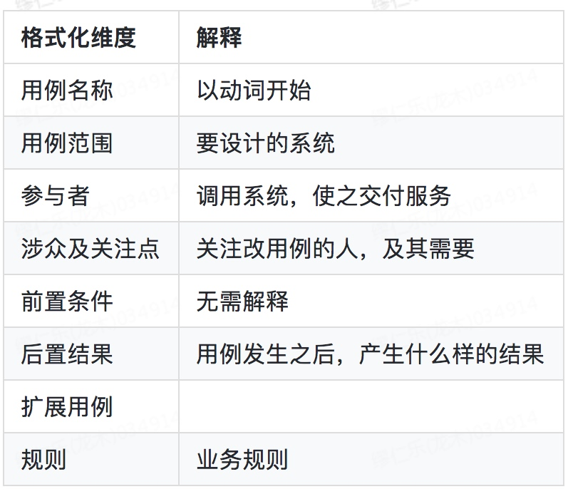

## 领域建模

ATA好文推荐阅读：
https://www.atatech.org/articles/51799

领域建模是对领域内的概念类或现实世界中对象的可视化表示。又称概念模型、领域对象模型、分析对象模型。它专注于分析问题领域本身，发掘重要得业务领域概念，并建立业务领域概念之间的关系。

领域模型 = 用例集+建模方法论

#### 概念
- 业务对象模型（也叫领域模型domain model）是描述业务用例实现的对象模型。它是对业务角色和业务实体之间应该如何联系和协作以执行业务的一种抽象。
- 业务对象模型从业务角色内部的观点定义了业务用例。
- 模型：业务过程中的操作实体

领域模型描述的是对事物的抽象，其中包含了属性、关联、操作

#### 核心元素
- 业务角色：一个人承担的一系列职责
- 业务实体：表示使用或产生的可交付工件、资源和事件
- 业务用例：实现显示协作的业务角色和业务实体如何执行某个工作流程。

#### 关系
- 泛化
- 依赖
- 关联

#### 设计步骤
领域模型设计是需求分析的关键步骤。它帮助用户及需求分析人员建立业务概念，确定用户业务的问题域，系统涉及的业务范围等等。

领域模型设计的步骤：

1. 从业务描述中提取名称
2. 从提取出来的名称中总结业务实体，区分名词中的属性、角色、实体、实例，形成问题域中操作实体的集合。
3. 从业务实体集合中抽象业务模型，建立问题域的概念
4. 用UML提供的方法和图例进行领域模型设计、确定模型之间的关系

#### 建模方法总结
1. 从准确的用例中剥离出名称
2. 根据名称梳理领域模型和其属性
3. 根据名称的修饰梳理出属性值
4. 根据名称的定义完善属性值
5. 从用例集合中剥离出动词&形容词
6. 根据动词&形容词梳理出领域模型之间的关系

根据这个流程，可以整理出下述流程图：

注意：用例的不完善，不准确，会直接决定了模型的不正确。

##### 从用例集中提取模型
1. 找名称，以主语和宾语为主，找到名称基本可以确定我们的模型（只能说基本）。
2. 找形容词，存在于定语和状语中，找到形容词基本可以确定对应属性的值

#### 种类
##### 失血模型
就是domain object只有属性的getter/setter方法，没有任何业务逻辑。

在Java中，我们一般定义POJO，只有简单的基于字段的setter，getter方法。POJO之间的关系隐藏在对象的某些ID里，由外部的manager解释。

##### 贫血模型
就是domain object包含了不依赖于持久化的领域逻辑，而那些依赖持久化的领域逻辑被分离到Service层。

Service（业务逻辑，事务封装）-->DAO-->domain object

这种模型的优点：

- 各层单向依赖，结构清晰，易于实现和维护
- 设计简单易行，底层模型非常稳定

这种模型的缺点：

- domain object的部分比较紧密依赖得持久化domain logic被分离到Service层，显得不够OO
- Service层过于厚重

##### 充血模型
与贫血模型类似，所不同的就是如何划分业务逻辑。即认为，绝大多数业务逻辑都应该被放在domain object里面（包括持久化逻辑），而Service层应该是很薄的一层，仅仅封装事务和少量逻辑，不和DAO层打交道。

Service（事务封装）-->domain object <--> DAO

这种模型的优点：

- 更加符合OO的原则
- Service层很薄，只充当Facade的角色，不和DAO打交道

这种模型的缺点：

- DAO和domain object形成了双向依赖，复杂的双向依赖会导致很多潜在的问题
- 如何划分Service层逻辑和domain层逻辑是非常含糊的，在实际项目中，由于设计和开发人员的水平差异，可能导致整个结构的混乱无序。
- 考虑到Service层的事务封装特性，Service层必须对所有的domain object的逻辑提供相应的事务封装方法，其结果就是Service完全重定义一遍所有的domain logic，非常繁琐。

##### 胀血模型
基于充血模型的第三个缺点，有人提出，干脆取消Service层，只剩下domain object和DAO两层，在domain object的domain logic上面封装事务。

domain object（事务封装，业务逻辑） <--> DAO 

该模型的优点：

- 简化了分层
- 也算符合OO

该模型缺点：

- 很多不是domain logic的service逻辑也被强行放入domain object，引起了domain object模型的不稳定
- domain object暴露给web层过多的信息，可能引起意想不到的副作用。

失血模型和胀血模型应该是不被提倡的。**建议使用贫血模型**

#### 领域模型设计
设计上我们通常有两种维度入手

- Data Modeling：通过数据抽象系统关系，也就是数据库设计
- Object Modeling：通过面向对象方式抽象系统关系，也就是面向对象设计。

大部分架构师都是从data modeling开始设计软件系统，少部分人通过object modeling方式开始设计软件系统。这两种建模方式并不相互冲突，都很重要，但是从哪个方向开始设计，对系统最终形态有很大的区别。

##### Data Model
领域模型（有的也叫数据模型），十几年前叫数据字典。说白了，领域模型就是数据库设计，

##### 领域建模误区
- 谁使用放谁那里是典型的反模式，职责划分中，我们不能按照模型的使用者来划分边界
- 

### 领域建模体系化解决方案
体系化方案总体大图：

产品源自于市场，市场又是由两个C组成：

- customer（客户需要什么）
- competitor（竞争对手有什么）

架构师，必须要学习并理解老大们制定的战略中的业务核心和需要落地的产品组合，然后根据老大们的业务战略规划做出合理的技术上规划，并保证技术规划能正确的落地，带来收益。所以应用架构师从问题空间模型开始需要重点关注。

用例模板：

业务域边界会直接决定架构中相关系统的边界。如果业务域边界没有划分整理清楚，那么一般系统边界也会模糊从而带来一系列问题

**域边界划分的能力要写到P9应用架构的能力要求中去。**因为域边界不清晰，系统边界就不清晰，平台能力和业务逻辑耦合在一起，后期的研发效率会很低。

**先从用例推导出问题空间模型，然后从问题空间模型推导出解决空间模型。**
比如卖家、买家是问题空间模型中的业务概念，在解决空间模型中，可以抽象成账号 这个系统模型。
当然，问题空间领域模型和解决空间领域模型有时候是一一对应的。

